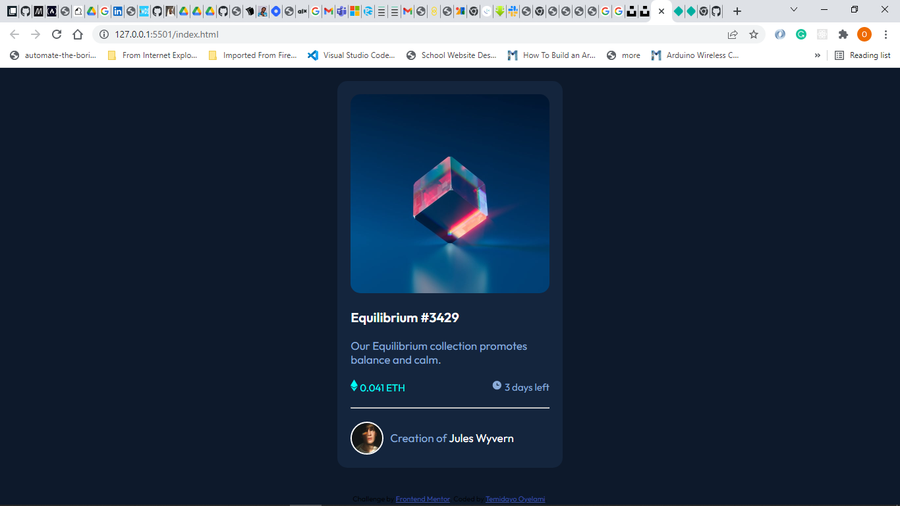
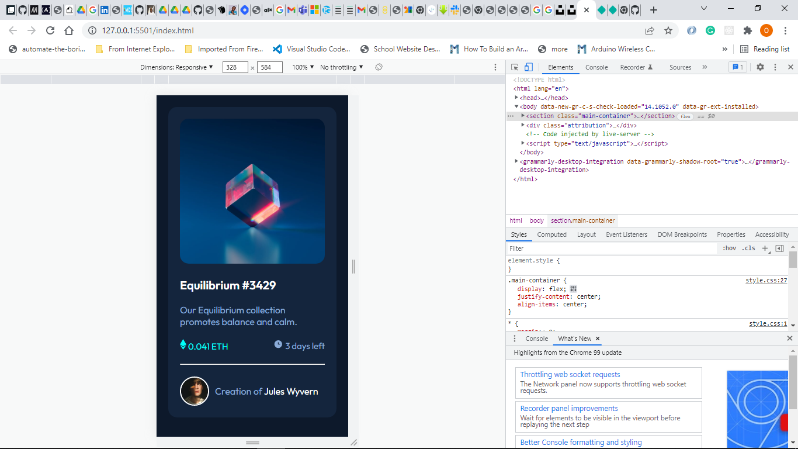

# Frontend Mentor - NFT preview card component solution

This is a solution to the [NFT preview card component challenge on Frontend Mentor](https://www.frontendmentor.io/challenges/nft-preview-card-component-SbdUL_w0U). Frontend Mentor challenges help you improve your coding skills by building realistic projects. 

## Table of contents

- [Overview](#overview)
  - [The challenge](#the-challenge)
  - [Screenshot](#screenshot)
  - [Links](#links)
- [My process](#my-process)
  - [Built with](#built-with)
  - [What I learned](#what-i-learned)
  - [Continued development](#continued-development)
  - [Useful resources](#useful-resources)
- [Author](#author)


## Overview

### The challenge

Users should be able to:

- View the optimal layout depending on their device's screen size
- See hover states for interactive elements

### Screenshot






### Links

- Solution URL: [Github](https://github.com/Temidayo99/nft-preview-card-component)
- Live Site URL: [Netlify](https://hardcore-stonebraker-06f7b1.netlify.app/)

## My process

### Built with

- Semantic HTML5 markup
- CSS custom properties
- Flexbox
- Mobile-first workflow

### What I learned

I learnt how to resize an image to become responsive.

```css
.equi-image {
  max-width: 100%;
  height: auto;
}
```

### Continued development

- Mobile responsiveness
- Flexbox

### Useful resources

- [Example resource 1](https://www.geeksforgeeks.org/resize-image-proportionally-with-css/) - This helped me for resizing the image. I really liked this pattern and will use it going forward.

## Author

- Website - [](https://temidayo-oyelami.netlify.app/#)
- Frontend Mentor - [@Temidayo99](https://www.frontendmentor.io/profile/Temidayo99)
- Twitter - [@themmyjoy](https://twitter.com/themmyjoy)
